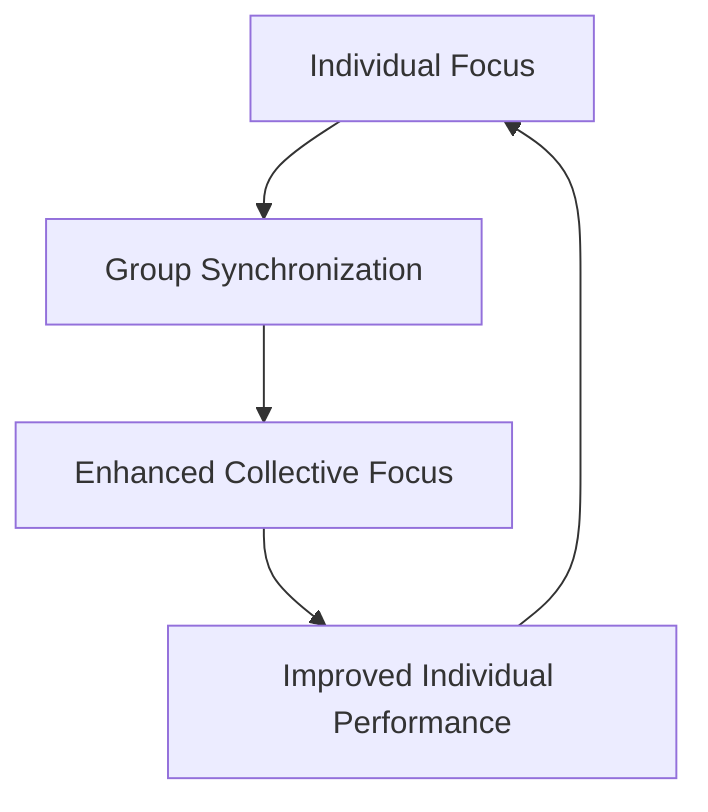

# The Psychology of Focus-Room

The Focus-Room methodology is grounded in established psychological principles that explain why it's so effective for enhancing productivity and well-being.

## The Science Behind Collective Focus

### Social Facilitation Effect

The presence of others engaged in the same activity tends to improve individual performance—a phenomenon first documented by psychologist Norman Triplett in 1898. In Focus-Room:

- **Passive social pressure** increases accountability
- **Unconscious mirroring** of others' focused behavior occurs naturally
- **Performance anxiety** is minimized as everyone is focused on their own work

### Synchronized Brainwave Patterns

Research in neuroscience has shown that people working in proximity tend to synchronize their brainwave patterns:



This creates a virtuous cycle where focus becomes contagious and self-reinforcing.

## Psychological Benefits

### Reduced Decision Fatigue

By establishing a structured time format:
- Participants don't need to decide when to take breaks
- The format eliminates constant internal negotiation about staying focused
- Mental energy is preserved for actual productive work

### Flow State Facilitation

The Focus-Room creates ideal conditions for achieving "flow" state, characterized by:
- Complete absorption in the task
- Altered sense of time
- Intrinsic reward from the activity itself

### Battling Procrastination

Focus-Room helps overcome procrastination through:
- **Implementation intentions**: Clear when-where plans for focused work
- **Temptation bundling**: Associating focused work with the pleasant social atmosphere
- **Immediate accountability**: The social cost of distraction is immediate

## Cognitive Restoration

The structured break periods in Focus-Room support cognitive restoration:

| Break Activity | Cognitive Benefit |
|----------------|-------------------|
| Physical movement | Increased blood flow to the brain |
| Social interaction | Activation of different neural pathways |
| Brief nature exposure | Attention restoration |
| Mindfulness moments | Reduced cognitive load |

## Individual Differences and Adaptations

Focus-Room can be adapted for different cognitive styles:

- **For highly sensitive people**: Designated quiet zones during breaks
- **For extroverts**: More interactive break activities
- **For neurodivergent participants**: Flexibility in movement and stimulation management
- **For different chronotypes**: Scheduling sessions at optimal times of day

Understanding these psychological mechanisms helps us design more effective Focus-Room experiences and customize them for different contexts and populations.

# Markdown Features

Docusaurus supports **[Markdown](https://daringfireball.net/projects/markdown/syntax)** and a few **additional features**.

## Front Matter

Markdown documents have metadata at the top called [Front Matter](https://jekyllrb.com/docs/front-matter/):

```text title="my-doc.md"
// highlight-start
---
id: my-doc-id
title: My document title
description: My document description
slug: /my-custom-url
---
// highlight-end

## Markdown heading

Markdown text with [links](./hello.md)
```

## Links

Regular Markdown links are supported, using url paths or relative file paths.

```md
Let's see how to [Create a page](/create-a-page).
```

```md
Let's see how to [Create a page](./create-a-page.md).
```

**Result:** Let's see how to [Create a page](./create-a-page.md).

## Images

Regular Markdown images are supported.

You can use absolute paths to reference images in the static directory (`static/img/docusaurus.png`):

```md

```


You can reference images relative to the current file as well. This is particularly useful to colocate images close to the Markdown files using them:

```md

```

## Code Blocks

Markdown code blocks are supported with Syntax highlighting.

````md
```jsx title="src/components/HelloDocusaurus.js"
function HelloDocusaurus() {
  return <h1>Hello, Docusaurus!</h1>;
}
```
````

```jsx title="src/components/HelloDocusaurus.js"
function HelloDocusaurus() {
  return <h1>Hello, Docusaurus!</h1>;
}
```

## Admonitions

Docusaurus has a special syntax to create admonitions and callouts:

```md
:::tip My tip

Use this awesome feature option

:::

:::danger Take care

This action is dangerous

:::
```

:::tip My tip

Use this awesome feature option

:::

:::danger Take care

This action is dangerous

:::

## MDX and React Components

[MDX](https://mdxjs.com/) can make your documentation more **interactive** and allows using any **React components inside Markdown**:

```jsx
export const Highlight = ({children, color}) => (
  <span
    style={{
      backgroundColor: color,
      borderRadius: '20px',
      color: '#fff',
      padding: '10px',
      cursor: 'pointer',
    }}
    onClick={() => {
      alert(`You clicked the color ${color} with label ${children}`)
    }}>
    {children}
  </span>
);

This is <Highlight color="#25c2a0">Docusaurus green</Highlight> !

This is <Highlight color="#1877F2">Facebook blue</Highlight> !
```

export const Highlight = ({children, color}) => (
  <span
    style={{
      backgroundColor: color,
      borderRadius: '20px',
      color: '#fff',
      padding: '10px',
      cursor: 'pointer',
    }}
    onClick={() => {
      alert(`You clicked the color ${color} with label ${children}`);
    }}>
    {children}
  </span>
);

This is <Highlight color="#25c2a0">Docusaurus green</Highlight> !

This is <Highlight color="#1877F2">Facebook blue</Highlight> !
