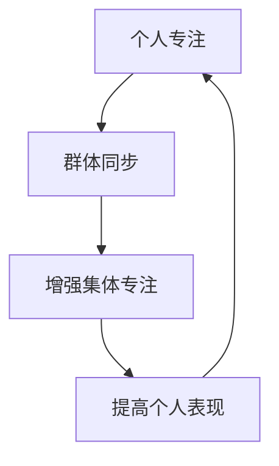

# Focus-Room 的心理学

Focus-Room 方法论建立在已经确立的心理学原理基础上，这些原理解释了为什么它对提高生产力和幸福感如此有效。

## 集体专注背后的科学

### 社会促进效应

他人从事相同活动的存在往往会提高个人表现——这一现象首次由心理学家 Norman Triplett 在 1898 年记录。在 Focus-Room 中：

- **被动社会压力**增加责任感
- **无意识模仿**他人专注行为自然发生
- **表现焦虑**被最小化，因为每个人都专注于自己的工作

### 同步的脑波模式

神经科学研究表明，在近距离工作的人倾向于同步他们的脑波模式：



这创造了一个良性循环，专注变得具有传染性并自我强化。

## 心理学益处

### 减少决策疲劳

通过建立结构化的时间格式：
- 参与者不需要决定何时休息
- 该格式消除了关于保持专注的持续内部协商
- 保留精神能量用于实际的生产性工作

### 促进心流状态

Focus-Room 创造了实现"心流"状态的理想条件，其特征是：
- 完全沉浸在任务中
- 改变时间感
- 从活动本身获得内在奖励

### 战胜拖延症

Focus-Room 通过以下方式帮助克服拖延症：
- **执行意图**：明确的何时何地专注工作计划
- **诱惑捆绑**：将专注工作与愉快的社交氛围联系起来
- **即时责任**：分心的社交成本是即时的

## 认知恢复

Focus-Room 中的结构化休息时间支持认知恢复：

| 休息活动 | 认知益处 |
|----------------|-------------------|
| 身体活动 | 增加大脑血流 |
| 社交互动 | 激活不同的神经通路 |
| 短暂自然接触 | 注意力恢复 |
| 正念时刻 | 减少认知负荷 |

## 个体差异和适应

Focus-Room 可以适应不同的认知风格：

- **对于高度敏感的人**：休息期间指定安静区域
- **对于外向者**：更多互动性休息活动
- **对于神经多样性参与者**：在运动和刺激管理方面的灵活性
- **对于不同的时间类型**：在一天中最佳时间安排会话

理解这些心理机制有助于我们设计更有效的 Focus-Room 体验，并为不同的情境和人群定制它们。

# Markdown 功能

Docusaurus 支持 **[Markdown](https://daringfireball.net/projects/markdown/syntax)** 和一些**附加功能**。

## 前言

Markdown 文档顶部有称为 [Front Matter](https://jekyllrb.com/docs/front-matter/) 的元数据：

```text title="my-doc.md"
// highlight-start
---
id: my-doc-id
title: My document title
description: My document description
slug: /my-custom-url
---
// highlight-end

## Markdown heading

Markdown text with [links](./hello.md)
```

## 链接

支持常规 Markdown 链接，使用 URL 路径或相对文件路径。

```md
让我们看看如何 [创建页面](/create-a-page)。
```

```md
让我们看看如何 [创建页面](./create-a-page.md)。
```

**结果：** 让我们看看如何 [创建页面](./create-a-page.md)。

## 图片

支持常规 Markdown 图片。

您可以使用绝对路径引用静态目录中的图片（`static/img/docusaurus.png`）：

```md

```


您也可以引用相对于当前文件的图片。这对于将图片与使用它们的 Markdown 文件放在一起特别有用：

```md

```

## 代码块

支持带有语法高亮的 Markdown 代码块。

````md
```jsx title="src/components/HelloDocusaurus.js"
function HelloDocusaurus() {
  return <h1>Hello, Docusaurus!</h1>;
}
```
````

```jsx title="src/components/HelloDocusaurus.js"
function HelloDocusaurus() {
  return <h1>Hello, Docusaurus!</h1>;
}
```

## 警告提示

Docusaurus 有一种特殊的语法来创建警告和提示：

```md
:::tip 我的提示

使用这个很棒的功能选项

:::

:::danger 小心

这个操作很危险

:::
```

:::tip 我的提示

使用这个很棒的功能选项

:::

:::danger 小心

这个操作很危险

:::

## MDX 和 React 组件

[MDX](https://mdxjs.com/) 可以使您的文档更具**交互性**，并允许在 Markdown 内使用任何 **React 组件**：

```jsx
export const Highlight = ({children, color}) => (
  <span
    style={{
      backgroundColor: color,
      borderRadius: '20px',
      color: '#fff',
      padding: '10px',
      cursor: 'pointer',
    }}
    onClick={() => {
      alert(`您点击了颜色 ${color}，标签是 ${children}`)
    }}>
    {children}
  </span>
);

这是 <Highlight color="#25c2a0">Docusaurus 绿色</Highlight>！

这是 <Highlight color="#1877F2">Facebook 蓝色</Highlight>！
```

export const Highlight = ({children, color}) => (
  <span
    style={{
      backgroundColor: color,
      borderRadius: '20px',
      color: '#fff',
      padding: '10px',
      cursor: 'pointer',
    }}
    onClick={() => {
      alert(`您点击了颜色 ${color}，标签是 ${children}`);
    }}>
    {children}
  </span>
);

这是 <Highlight color="#25c2a0">Docusaurus 绿色</Highlight>！

这是 <Highlight color="#1877F2">Facebook 蓝色</Highlight>！ 